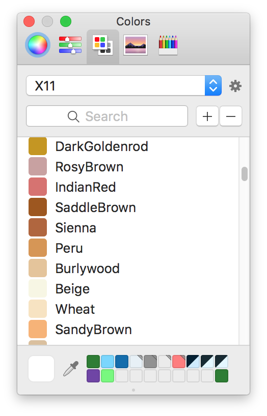
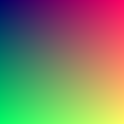
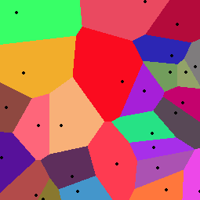

# BitmapCanvas
__Bitmap offscreen drawing in Swift for OS X__

__Description__

A clear, simple and concise API over a CoreGraphics bitmap context.  
Loosely inspired by the ImageDraw Python library.  
Especially useful for easy [data](https://github.com/nst/DevTeamActivity) [visualizations](https://github.com/nst/ShapefileReader).

__Features__

* upper-left corner based coordinates
* pixel perfect drawing of points, lines, rectangles, ellipses and texts
* colors as NSColor, hex strings ``"#AA00DF"`` or X11 names ``"SkyBlue"``
* save as PNG
* usable with regular CoreGraphics code

__Examples__

<TABLE>

<TR>
    <TD></TD>
    <TD><PRE>let b = BitmapCanvas(32, 32, "PapayaWhip")</PRE>
    </TD>
</TR>

<TR>
    <TD></TD>
<TD><PRE>b[1,1] = NSColor.blackColor()

b[1,3] = "red"
b[2,3] = "#00FF00"
b[3,3] = NSColor.blueColor()</PRE>
    </TD>
</TR>

<TR>
    <TD></TD>
    <TD><PRE>b.line(P(1,1), P(10,10))

b.line(P(1,10), P(10,19), "red")
b.lineHorizontal(P(1,21), width:20)
b.lineVertical(P(20, 1), height:19, "blue")</PRE>
    </TD>
</TR>

<TR>
    <TD></TD>
    <TD><PRE>b.rectangle(R(5,5,20,10))

b.rectangle(R(10,10,20,10), stroke:"blue", fill:"magenta")</PRE>
    </TD>
</TR>

<TR>
    <TD></TD>
    <TD><PRE>b.ellipse(R(5,5,20,10))

b.ellipse(R(10,10,18,21), stroke:"blue", fill:"magenta")</PRE>
    </TD>
</TR>

<TR>
    <TD></TD>
    <TD><PRE>let b = BitmapCanvas(32, 32, "PapayaWhip")

b.line(P(10,0), P(25,31), "red")

b.ellipse(R(15,10,15,15))

b.fill(P(30,1), color:"yellow")
</PRE>
    </TD>
</TR>

<TR>
    <TD></TD>
    <TD><PRE>b.text("hi", P(5,10))

b.text("hello", P(20,30),
    rotationDegrees: -90,
    font: NSFont(name: "Helvetica", size: 10)!,
    color: NSColor.redColor())</PRE>
    </TD>
</TR>

<TR>
    <TD></TD>
    <TD><PRE>b.image(fromPath:"/usr/share/httpd/icons/sphere2.png", P(0,0))</PRE>
    </TD>
</TR>

<TR>
    <TD></TD>
    <TD><PRE>let b = BitmapCanvas(32, 32, "PapayaWhip")

b.setAllowsAntialiasing(true)

let points = [P(3,3), P(28,5), P(25,22), P(12,18)]

b.polygon(points, stroke:"blue", fill:"SkyBlue")

b.save("/tmp/polygon.png", open:true)</PRE>
    </TD>
</TR>

<TR>
    <TD></TD>
    <TD><PRE>b.setAllowsAntialiasing(true)

NSColor.orangeColor().setFill()

let bp = NSBezierPath()
bp.moveToPoint(P(2,2))
bp.curveToPoint(P(20,14), controlPoint1: P(14,30), controlPoint2: P(15,30))
bp.curveToPoint(P(32,13), controlPoint1: P(24,14), controlPoint2: P(24,19))
bp.closePath()
bp.fill()
bp.stroke()</PRE>
    </TD>
</TR>

<TR>
<TD></TD>
<TD><PRE>CGContextAddEllipseInRect(b.cgContext, R(2, 2, 24, 24))
CGContextStrokePath(b.cgContext)

b.setAllowsAntialiasing(true)

CGContextSetStrokeColorWithColor(b.cgContext, NSColor.blueColor().CGColor)
CGContextAddEllipseInRect(b.cgContext, R(12, 12, 24, 24))
CGContextStrokePath(b.cgContext)</PRE>
</TD>
</TR>

<TR>
    <TD></TD>
    <TD><PRE>b.save("/tmp/image.png", open:true)</PRE>
    </TD>
</TR>

</TABLE>

You can also dump the X11 color list with:

    X11Colors.dump("/opt/X11/share/X11/rgb.txt", outPath:"/tmp/X11.clr")

or download the file directly [X11.clr.zip](https://raw.githubusercontent.com/nst/BitmapCanvas/master/files/X11.clr.zip)



Other images with sample code:



```Swift
let (w, h) = (255, 255)

let b = BitmapCanvas(w, h)
for i in 0..<w {
    for j in 0..<h {
        b[i,j] = NSColor(i,j,100)
    }
}

b.save("/tmp/gradient.png")
```



```Swift
let w = 255
let h = 255
let n = 25

let b = BitmapCanvas(w, h)

var pointsColors : [(NSPoint, NSColor)] = []

for _ in 0...n {
    let p = RandomPoint(maxX: w, maxY: h)
    let c = NSColor.randomColor()
    pointsColors.append((p,c))
}

for x in 0...w-1 {
    for y in 0...h-1 {
        let distances = pointsColors.map { hypot($0.0.x - x, $0.0.y - y) }
        b[x,y] = pointsColors[distances.indexOf(distances.minElement()!)!].1
    }
}

for (p,_) in pointsColors {
    let rect = R(p.x-1, p.y-1, 3, 3)
    b.ellipse(rect, stroke:"black", fill:"black")
}

b.save("/tmp/voronoi.png")
```


```Swift
// http://www.visualcinnamon.com/2015/01/exploring-art-hidden-in-pi.html

let (w,h) = (2500,2300)

let b = BitmapCanvas(w,h, "white")

b.setAllowsAntialiasing(true)

// read data

// https://www.angio.net/pi/digits.html
let path = PROJECT_PATH+"/files/1000000.txt"

guard let
    data = NSFileManager.defaultManager().contentsAtPath(path),
    s = NSString(data: data, encoding: NSASCIIStringEncoding) as? String else {
        assertionFailure(); return
}

let ints = s.characters.flatMap { Int(String($0)) }

// setup colors + origin

let palette = [C(233,154,0),C(232,139,0),C(230,101,0),C(266,58,7),C(215,15,25),
               C(206,0,35),C(191,0,48),C(173,0,62),C(154,0,78),C(137,0,96),
               C(119,16,116),C(95,38,133),C(71,51,149),C(52,73,148),C(33,96,137),
               C(20,118,121),C(23,140,97),C(33,157,79),C(73,167,70),C(101,174,62)]

let origin = P(600, 300)
var p = origin

// walk and draw

for (c, i) in ints.enumerate() {
    let paletteIndex = Int(Double(c) / Double(ints.count) * Double(palette.count))
    let color = palette[paletteIndex]
    p = b.line(p, length:2, degreesCW:36.0 * i, color)
}

// highlight starting point

b.setAllowsAntialiasing(false)

b.ellipse(R(origin.x-4, origin.y-4, 8, 8), stroke: "black", fill: "black")

// legend

let legendPoint = P(1500,1100)

// legend - pi

let fontPi = NSFont(name: "Times", size: 384)!
let font = NSFont(name: "Times", size: 48)!

b.text("π", P(legendPoint.x+300,legendPoint.y), font: fontPi)

// legend - compass

let compassOrigin = P(legendPoint.x + 400, legendPoint.y + 600)
b.context.saveGraphicsState()
CGContextSetLineWidth(b.cgContext, 10.0)
for degrees in 0.stride(to: 360, by: 36) {
    let p2 = b.line(compassOrigin, length:200, degreesCW:CGFloat(degrees), "white")
    b.text(String(Int(Double(degrees)/36.0)), P(p2.x, p2.y), rotationDegrees: CGFloat(degrees), font: font, color: "DarkGrey")
    b.line(compassOrigin, length:140, degreesCW:CGFloat(degrees), "DarkGrey")
}
b.context.restoreGraphicsState()

// legend - color scale

let boxOrigin = P(legendPoint.x, legendPoint.y+1000)
let boxWidth : CGFloat = 40.0
let boxHeight : CGFloat = 20.0
for (i, color) in palette.enumerate() {
    b.rectangle(R(legendPoint.x+Double(i)*boxWidth,legendPoint.y+1000,boxWidth,boxHeight), stroke: color, fill: color)
}

b.text("start", P(boxOrigin.x, boxOrigin.y - 50), font: font, color: "DarkGrey")
b.text("end", P(boxOrigin.x + boxWidth * palette.count - 60, boxOrigin.y - 50), font: font, color: "DarkGrey")

let filename = (path as NSString).lastPathComponent
b.text(filename, P(boxOrigin.x + 300, boxOrigin.y - 50), font: font, color: "DarkGrey")

b.save("/tmp/piwalk.png", open: true)
```
