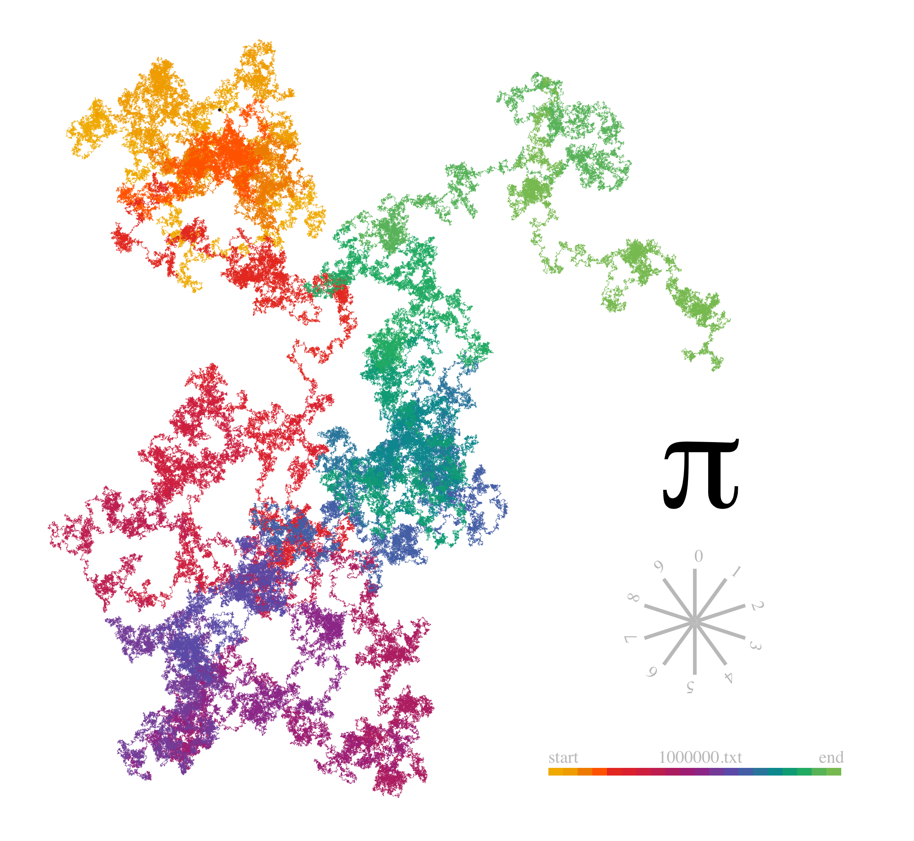

# BitmapCanvas
__Bitmap offscreen drawing in Swift for OS X__

__Description__

A clear, simple and concise API over a CoreGraphics bitmap context.  
Loosely inspired by the ImageDraw Python library.  
Especially useful for easy [data](https://github.com/nst/DevTeamActivity) [visualizations](https://github.com/nst/ShapefileReader).

__Features__

* upper-left corner based coordinates
* pixel perfect drawing of points, lines, rectangles, ellipses and texts
* colors as NSColor, hex strings ``"#AA00DF"`` or X11 names ``"SkyBlue"``
* save as PNG
* usable with regular CoreGraphics code

__Examples__

<TABLE>

<TR>
    <TD></TD>
    <TD><PRE>let b = BitmapCanvas(32, 32, "PapayaWhip")</PRE>
    </TD>
</TR>

<TR>
    <TD></TD>
<TD><PRE>b[1,1] = NSColor.blackColor()

b[1,3] = "red"
b[2,3] = "#00FF00"
b[3,3] = NSColor.blueColor()</PRE>
    </TD>
</TR>

<TR>
    <TD></TD>
    <TD><PRE>b.line(P(1,1), P(10,10))

b.line(P(1,10), P(10,19), "red")
b.lineHorizontal(P(1,21), width:20)
b.lineVertical(P(20, 1), height:19, "blue")</PRE>
    </TD>
</TR>

<TR>
    <TD></TD>
    <TD><PRE>b.rectangle(R(5,5,20,10))

b.rectangle(R(10,10,20,10), stroke:"blue", fill:"magenta")</PRE>
    </TD>
</TR>

<TR>
    <TD></TD>
    <TD><PRE>b.ellipse(R(5,5,20,10))

b.ellipse(R(10,10,18,21), stroke:"blue", fill:"magenta")</PRE>
    </TD>
</TR>

<TR>
    <TD></TD>
    <TD><PRE>let b = BitmapCanvas(32, 32, "PapayaWhip")

b.line(P(10,0), P(25,31), "red")

b.ellipse(R(15,10,15,15))

b.fill(P(30,1), color:"yellow")
</PRE>
    </TD>
</TR>

<TR>
    <TD></TD>
    <TD><PRE>b.text("hi", P(5,10))

b.text("hello", P(20,30),
    rotationDegrees: -90,
    font: NSFont(name: "Helvetica", size: 10)!,
    color: NSColor.redColor())</PRE>
    </TD>
</TR>

<TR>
    <TD></TD>
    <TD><PRE>b.image(fromPath:"/usr/share/httpd/icons/sphere2.png", P(0,0))</PRE>
    </TD>
</TR>

<TR>
    <TD></TD>
    <TD><PRE>let b = BitmapCanvas(32, 32, "PapayaWhip")

b.setAllowsAntialiasing(true)

let points = [P(3,3), P(28,5), P(25,22), P(12,18)]

b.polygon(points, stroke:"blue", fill:"SkyBlue")

b.save("/tmp/polygon.png", open:true)</PRE>
    </TD>
</TR>

<TR>
    <TD></TD>
    <TD><PRE>b.setAllowsAntialiasing(true)

NSColor.orangeColor().setFill()

let bp = NSBezierPath()
bp.moveToPoint(P(2,2))
bp.curveToPoint(P(20,14), controlPoint1: P(14,30), controlPoint2: P(15,30))
bp.curveToPoint(P(32,13), controlPoint1: P(24,14), controlPoint2: P(24,19))
bp.closePath()
bp.fill()
bp.stroke()</PRE>
    </TD>
</TR>

<TR>
<TD></TD>
<TD><PRE>CGContextAddEllipseInRect(b.cgContext, R(2, 2, 24, 24))
CGContextStrokePath(b.cgContext)

b.setAllowsAntialiasing(true)

CGContextSetStrokeColorWithColor(b.cgContext, NSColor.blueColor().CGColor)
CGContextAddEllipseInRect(b.cgContext, R(12, 12, 24, 24))
CGContextStrokePath(b.cgContext)</PRE>
</TD>
</TR>

<TR>
    <TD></TD>
    <TD><PRE>b.save("/tmp/image.png", open:true)</PRE>
    </TD>
</TR>

</TABLE>

You can also dump the X11 color list with:

    X11Colors.dump("/opt/X11/share/X11/rgb.txt", outPath:"/tmp/X11.clr")

or download the file directly [X11.clr.zip](https://raw.githubusercontent.com/nst/BitmapCanvas/master/files/X11.clr.zip)


Other images with sample code:


```Swift
let (w, h) = (255, 255)

let b = BitmapCanvas(w, h)
for i in 0..<w {
    for j in 0..<h {
        b[i,j] = NSColor(i,j,100)
    }
}

b.save("/tmp/gradient.png")
```


```Swift
let w = 255
let h = 255
let n = 25

let b = BitmapCanvas(w, h)

var pointsColors : [(NSPoint, NSColor)] = []

for _ in 0...n {
    let p = RandomPoint(maxX: w, maxY: h)
    let c = NSColor.randomColor()
    pointsColors.append((p,c))
}

for x in 0...w-1 {
    for y in 0...h-1 {
        let distances = pointsColors.map { hypot($0.0.x - x, $0.0.y - y) }
        b[x,y] = pointsColors[distances.indexOf(distances.minElement()!)!].1
    }
}

for (p,_) in pointsColors {
    let rect = R(p.x-1, p.y-1, 3, 3)
    b.ellipse(rect, stroke:"black", fill:"black")
}

b.save("/tmp/voronoi.png")
```

Other pictures with source code in the project:


